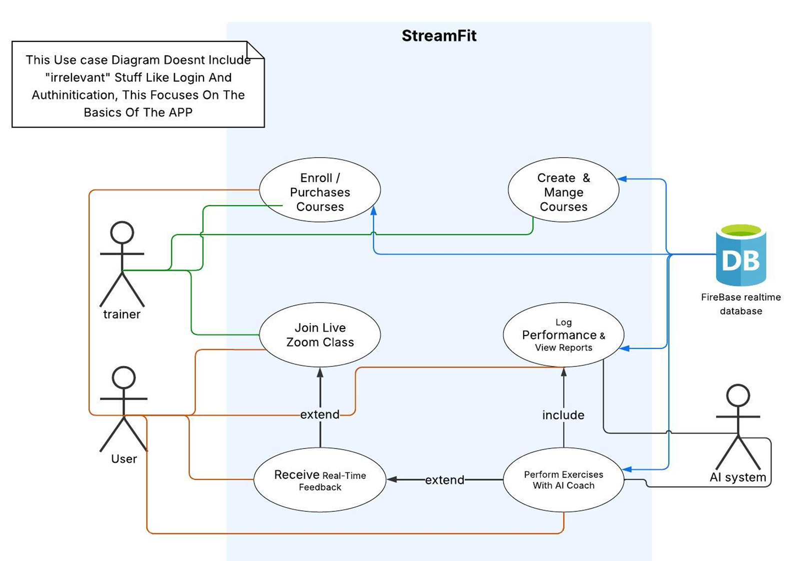

# StreamFit – Live AI-Powered Fitness Platform

## Overview

**StreamFit** is an innovative, web-based platform that enables real-time fitness training through live video sessions. The platform connects users with professional coaches via Zoom and integrates AI-powered posture and movement correction. StreamFit supports personalized workouts including yoga, Pilates, full-body training, and targeted exercises like biceps curls and squats.

The system includes instructor-created courses, AI trainers with real-time feedback, training history and reports, and calendar integration — making it a complete virtual gym tailored for both participants and instructors.

## Features

- **Live Video Training**: Real-time Zoom classes with certified instructors across multiple fitness categories.
- **AI Trainer**: Posture and movement correction using TensorFlow.js and MediaPipe, with real-time Hebrew voice feedback.
- **Progress Tracking**: Firebase integration to log training sessions, pose durations, and rep counts.
- **Leaderboard & Reports**: Weekly performance insights and motivational summaries based on user data.
- **Instructor Tools**: Create/edit courses, schedule classes, and monitor participants.
- **Notifications & Chat**: Integrated messaging system and alert notifications for new classes or feedback.
- **Calendar Sync**: Visual timeline of completed sessions and upcoming workouts.
- **Responsive Design**: Accessible on desktop, tablet, and mobile screens.

## Technology Stack

- **React**: Frontend web application.
- **Firebase**: Authentication, Firestore database, and file storage.
- **Flask**: Backend for AI trainer (Biceps, Squat) using Python and OpenCV.
- **TensorFlow.js + MediaPipe**: Real-time pose detection and form correction.
- **Chart.js**: Visual workout summaries and progress graphs.
- **Zoom SDK**: Integrated for live class video calls.
- **GitHub Actions**: CI/CD and version control for deployment simulation.

## Project DEMO (4 Minutes)

## Full Project Presentation (15 Minutes)

## Project Poster

- [View Poster in High Resolution (PDF)](./poster.pdf)

## AI Use Case Diagram

## AI Posture Correction Flow

## Academic Reports (Newest to Oldest)

- [Final Project Report (PDF)](./StreamFit-final-signed.pdf)
- [Alpha Report (PDF)](./StreamFit-alpha.pdf)
- [Project Proposal (PDF)](./proposal_report.pdf)

## Contact

For questions or more information, feel free to contact me at [mahmoudfiron13@gmail.com].
